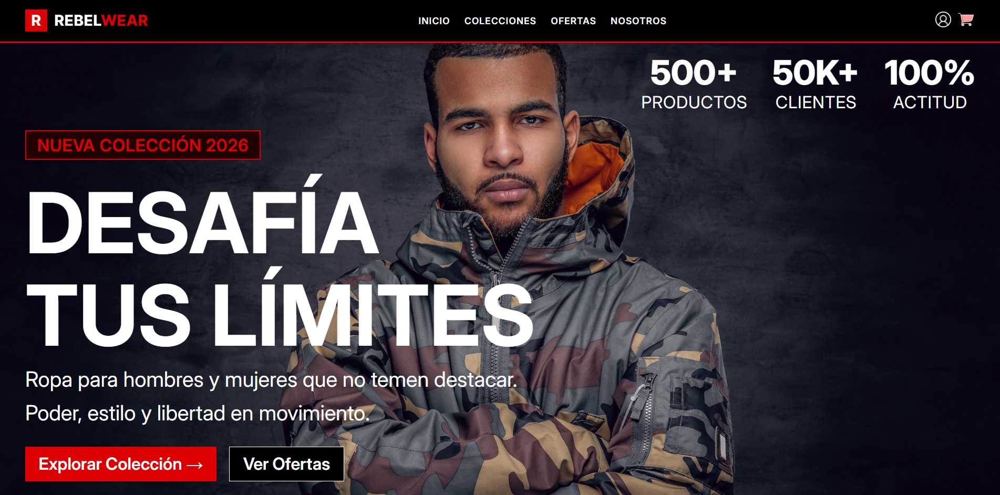
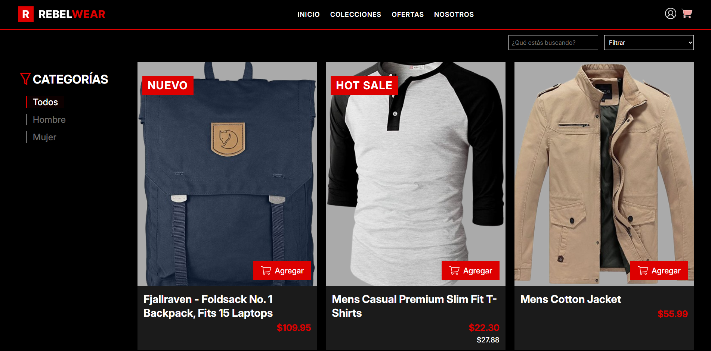
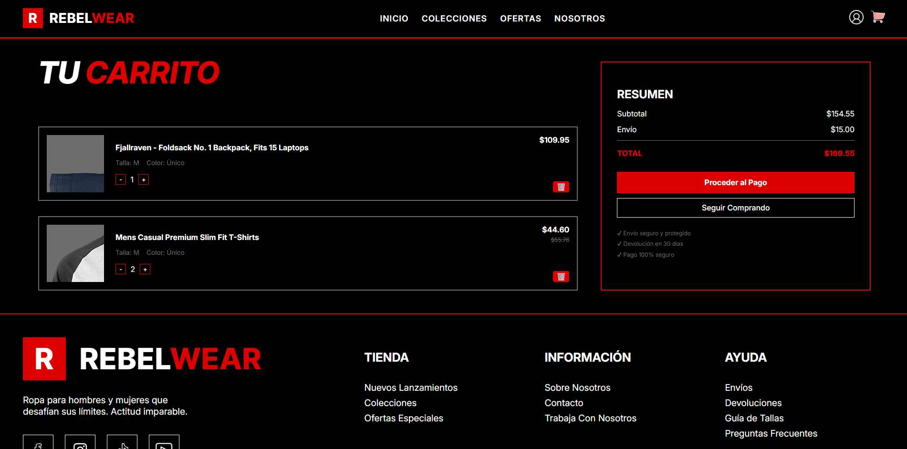
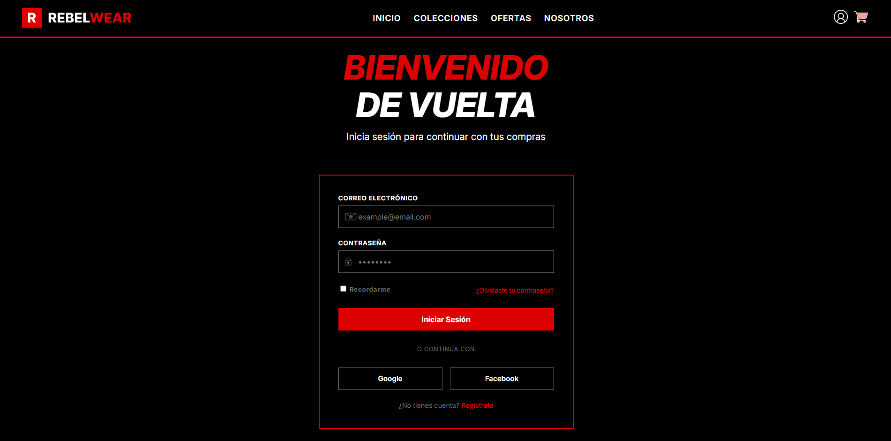

# 🛒 RebelWear – FakeStore

A virtual store simulation **(FakeStore)** built with **HTML5, CSS3, and vanilla JavaScript**, consuming data from a public external API and applying solid frontend architecture practices.

The conceptual brand of the project is **RebelWear**, a clothing store with a modern, urban, and functional identity.

---

## 🖼️ Main views

| Home | Catalog |
|---|---|
|  |  |

| Cart | Account |
|---|---|
|  |  |

---

## 🎯 Project goal

Build a web application that:

- Consumes data from an external API using fetch.
- Dynamically renders products in the DOM.
- Implements a shopping cart with localStorage persistence.
- Applies event handling and asynchronous JavaScript.
- Delivers a fully responsive interface, from desktop to mobile.

---

## 🔄 Features

- Dynamic product listing consumed from the API
- Catalog with category filters, text search, sorting, and pagination
- Shopping cart with localStorage persistence (add, remove, change quantity)
- Automatic subtotal, shipping, and total calculation, with free shipping from $200
- Product tagging system (NEW / HOT SALE) with strikethrough price on sale items
- Login form (UI only, no backend)
- Responsive design across all 4 pages (home, catalog, cart, account)

---

## 🛠️ Tech stack

- HTML5 – Site structure
- CSS3 – Responsive design and layout
- JavaScript (Vanilla JS, ES Modules) – Logic, DOM, and asynchrony
- FakeStore API – Product data source

---

## 🧱 Design

[Original frontend design (PDF)](./docs/fake-store-project.pdf)

---

## 🌐 API used

**FakeStore API**: https://fakestoreapi.com/products

Consumption logic lives isolated in `js/api.js`, kept separate from any presentation logic:

- `fetch()` with `async/await` against the `/products` endpoint, wrapped in `try/catch` so a network failure doesn't break the render (falls back to an empty array instead of crashing the page).
- The full catalog is filtered down to just `men's clothing` and `women's clothing`, the categories relevant to a clothing store.
- Each product runs through `tagProduct()` (`js/product-tags.js`), which adds business flags (`isNew`, `onSale`, `originalPrice`) without mutating the original API data — so the rest of the app always works with the same tagged product shape.
- Home and catalog both reuse the same `getClothingProducts()` function instead of duplicating the fetch call in each file, so if the API changes there's only one place to update.

---

## ⚙️ Setup instructions

1. **Get the project**

```bash
   git clone https://github.com/jorgegmch/proyecto-fakestore-rebelwear.git
```

   Or download the ZIP from the repository.

2. **Open the HTML file**
   - Locate `index.html`.
   - Open it with Live Server or directly in your browser (Chrome, Firefox, Edge, Safari). 🌐

---

## 🧭 Usage

- Browse the catalog, filter by category (Men/Women), search by name, sort by price, and page through results.
- Add a product to the cart from the home preview or the catalog grid.
- Open the cart to adjust quantities or remove items — subtotal, shipping, and total update automatically.
- Free shipping kicks in once the subtotal reaches $200.

---

## 📁 Project structure

```bash
REBELWEAR-UI
├── css
│   ├── auth.css
│   ├── base.css
│   ├── cart.css
│   ├── catalog.css
│   ├── components.css
│   ├── home.css
│   └── layout.css
│
├── docs
│   ├── documentation-images
│   │   ├── account.png
│   │   ├── catalog.png
│   │   ├── home.png
│   │   └── shopping-cart.png
│   ├── analysis.md
│   └── fake-store-project.pdf
│
├── html
│   ├── account.html
│   ├── catalog.html
│   └── shopping-cart.html
│
├── img
│   ├── gif
│   └── png
│
├── js
│   ├── api.js
│   ├── cart.js
│   ├── catalog.js
│   ├── components.js
│   ├── dom-helpers.js
│   ├── filters.js
│   ├── index.js
│   ├── layout.js
│   ├── product-tags.js
│   ├── shopping-cart.js
│   ├── storage.js
│   └── ui.js
│
├── .gitignore
├── index.html
├── LICENSE
└── README.md
```

---

## Possible Extensions

- Replace the FakeStore API with a real product database — the catalog currently depends on a read-only external API, with no way to persist or manage real inventory
- Build out the **Offers** and **About Us** pages — the links already exist in the navbar across all 4 pages, but currently point to `#`
- Real sign-up and login — `account.html` is UI only, with no backend or validation
- Checkout / payment flow — the "Proceed to Payment" button in the cart isn't wired up to anything
- Individual product detail page

---

## License

MIT — see [LICENSE](./LICENSE) for details.

Built by [Jorge Gomez](https://github.com/jorgegmch)
